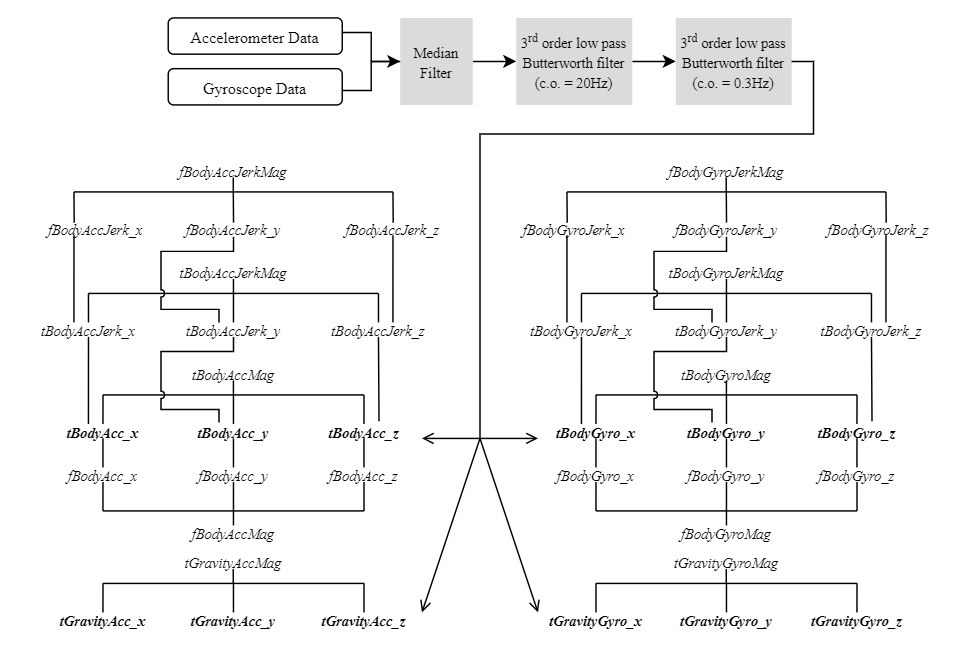

# Human Activity Recognition (HAR) using  Smartphones (python)
### Authors
    - Christopher Galea
    - Celine Suban
    - Diana Darmanin
                                                                                                        University of Malta

## Introduction

*This is the submission for a Group Assigned Practical Task. GAPT ICS2000* 

`<Documentation>` (link for documentation here)

The below code shows the preprocessing of raw **accelerometer** and **gyroscope** data and implementation of Machine Learning (ML) Models in order to detect and recognise human activity (**Walking, Jogging, Sitting, Laying, Falling and Walking Up/Down Stairs**)

- `preprocessing.ipynb` contains the code that handles the preprocessing of the data
- `models.ipynb` contains the implementation of the code using the[ dataset](https://www.kaggle.com/uciml/human-activity-recognition-with-smartphones " dataset") used in [*Anguita et. al 2013*](https://www.elen.ucl.ac.be/Proceedings/esann/esannpdf/es2013-84.pdf "*Anguita et. al 2013*")
- `Kaggle Dataset` is a folder that contains the data collected by Anguita et. al
- - `train.csv` contains the preprocessed train data
- - `test.csv` contains the preprocessed test data
- `Data Collection` is a folder that contains the data we collected. It contains three folders:
 - - `Data Collection\Walking and Sitting`
 - -  `Data Collection\Jogging and Falling`
 - - `Data Collection\Laying and Walking Up/Down Stairs`

## Data Collection
Each record log contains 3 files.
*Example*: A record for Jogging would looks something like:
 - `DataCollection\Jogging and Falling\Jogging_1.3_(1)\accelerometer.csv`
 - `DataCollection\Jogging and Falling\Jogging_1.3_(1)\gyroscope.csv`
 - `DataCollection\Jogging and Falling\Jogging_1.3_(1)\metadata.csv`
Both sensor csv have 5 columns: 
1. Time in UNIX epoch nanoseconds
2. Time in seconds
3. x axis
4. y axis
5. z axis

## Preprocessing
|  Smartphone |  Activities | Sampling Frequency  |
| ------------ | ------------ | ------------ |
| One Plus 6T  | Jogging and Falling  | 200Hz (average)  |
|  Samsung A8 | Walking and Sitting  | 100Hz (average)  |
|  Samsung A51 | Laying and Walking Up/Down Stairs  | 120Hz (average)  |



> Flow of feature extraction
> This image depicts how we managed to extract a total of 40 values. Then we calculated a number of variables to these values. These values are
> - mean()        mean value
> - std()         sandard deviation
> - max()         smallest value
> - min()         largest value
> - iqr()         inter quartile range
> - mad()         median absolute value
> - skewness()    skewness of the frequency domain signal
> - kurtosis()    kurtosis of the frequency domain signal
> - entropy()     signal entropy
> Thus creating a total of **__** features

We then obtained the Activity and Environment* Columns and converted everything into 2 csv files. One for training and another for testing.

\* *the environment column is not that important. it was used to keep track of what the data means*


## Applying ML Models to the data
`sklearn` Library was used to implement an SVM 
`keras and sklearn` Libraries were used to implement a Neural Net
`keras` Library was used to implement an LSTM

The data was adjusted so that it matches each models’ input type and then was split into `x` and `y`. 
One occurrence in ‘`x`’ holds the different features of one occurrence of one activity while the corresponding ‘`y`’ holds the activity name.


```python
training_data = pd.read_csv('train.csv')
testing_data = pd.read_csv('test.csv')

# Get X and y for training data
y_train = training_data['Activity']
X_train = training_data.drop(columns = ['Activity', 'subject'])

# Get X and y for testing data
y_test = testing_data['Activity']
X_test = testing_data.drop(columns = ['Activity', 'subject'])
```

The accuracy of the models was as follows:
| Model  | Accuracy  |
| ------------ | ------------ |
|  SVM |  95.0458% |
|  **NN** |  **95.3851%** |
|  LSTM |  88.2592% |

With NN performing the best and LSTM performing the worst
